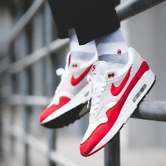

# A Tool-kit Of Techniques To Make Computer Vision Models Easier To Train And Evaluate
AIExpo Africa 2022 - Poster Presentation 

[Poster at the event](https://github.com/TRex22/MakeAISpeedy/raw/main/Final%20Poster%20Design.pdf)

## About me
I am a senior software engineer at a Fin-tech called DocFox and a master’s candidate at the University of the Witwatersrand focusing on computer vision, explainable AI and self-driving cars.

My blog: https://jasonchalom.com/blog

## Thanks
- My girlfriend :)
- My master's supervisor: Dr Richard Klein
- The Mathematical Sciences Support unit at the University of the Witwatersrand.
- PRIME Lab (Located at the University of the Witwatersrand, specialising in Computer Vision)
- Rail lab (https://www.raillab.org/)

# Abstract (150)
Machine learning techniques, especially in the area of computer vision, have opened a new frontier of research and industry - however the initial cost of entry into the field is a boundary, especially in developing economies. There are many techniques and approaches to optimising these work-flows in order to make them more computationally efficient, and therefore cheaper. Such techniques include traditional software engineering, data and signals processing, as well as more advanced optimisations to the model structures and training pipelines to make the process more efficient. These techniques have trade-offs and are task dependant but when combined appropriately can be a powerful tool-kit to improve computability of large work-flows. This poster evaluates a selection of techniques aimed at making computer vision easier to compute in memory usage, processor load, and time. These techniques are not always appropriate, and therefore several different types of tasks are considered.

# Introduction
Artificial intelligence (AI) is a fundamental part of the next industrial revolution. There is a lot of opportunity for innovation. However the cost, and access to AI - especially in computer vision - is a limiting factor in developing economies. AI on the edge is also limited by the practicality of the AI being used and such low power and embedded devices.

Many AI projects and state of the art models ignore training and evaluation cost in favour of the best results of the model. There are diminishing returns to obtaining the absolute best performance out of a model. Whilst having better accuracy and low loss when training AI models is desirable, practical use of such models does not always require the trade-offs of obtaining the best results and an acceptable level of error for more efficient use of computer resources can be acceptable.

# Methodology
For this investigation a classification problem, determining the brand of shoe from a given image is chosen[1]. This is a fairly common use case of such AI systems. The dataset is small at 16.53 MB in total, with three categories of shoes.

## Examples from the data set[1]

## Scope of experiments
Each experiment has a specific focus on a component of a simple computer vision pipeline:
1. This experiment looks at different models, their performance, time cost, and memory cost
2. Here I look at the effect of pre-processing the input image dimensional size and associated metrics of the chosen baseline model
3. The last experiment applies platform and library specific optimisations and evaluates the effect on the metrics of the chosen baseline model

## Metrics which are evaluated
1. The Accuracy of both training and test dataset splits
2. The time to complete an individual run of an experiment
3. Amount of memory is used by the AI model
4. The effective use of memory by an experimental run*

\*This was only done for experiment 3, to evaluate the effect of those optimisations on memory usage

Only a synthetic performance metric of the accuracy of the test set is used. More advanced metrics of performance should be evaluated in the future.

## Hardware used
I made use of my workstation which has 64GB of RAM, 6 core CPU with 12 threads and an Nvidia RTX 3060 with 12GB of RAM.

## Specific implementation details
Each experiment uses 100 epoch runs. Over training and over shooting is not considered. The specific training loops make use of an ADAM optimiser (with standard parameters used in the PyTorch documentation[2]). The loss function used is Cross Entropy Loss[3]. A custom data loader is used which randomises the order of the images each run. Random cropping is used, and the image pixels are automatically unscaled by the TorchVision transforms. A batch size of 100 was also used. All the ResNet models made use of TorchVision pre-implemented models[5].

# Experiment 1 - A look at different models
This experiment looks at the impact of model size on the accuracy and resource use of each experimental run. The family of ResNet models as well as a simple 2-layer convolutional neural network (CNN) with two linear neural networks (NN) at the end are evaluated.

A notable outcome of this experiment is that ResNet18 performed the best of all models and the small CNN performed slightly better than random guessing whist both used considerably less memory and took considerably less time to train and evaluate.

## Results
### Time impact
The smallest graphs took the least amount of time to train and evaluate

### Memory Impact
The smallest graphs consumed the least amount of memory

### Accuracy of the final models for each run
ResNet18 performed the best (in terms of test accuracy) over other models

# Experiment 2 - A look at image pre-processing
This experiment looks at the impact of the input image size on time, memory usage and the accuracy performance of the ResNet18 model.

As expected the smaller the dimensional size of the input images the faster the training and evaluation is and the less memory that is used. However accuracy does drop off quite substantially as the amount of input data decreases. only up to the 60x60x3 input size images are realistically usable. However the time and memory savings more than double.

## Results
### Time Impact

### Memory Impact

### Accuracy of the final models for each run

# Experiment 3 - The application of programmatic optimisations
This experiment looks at implementing some simple Python optimisations[4], such as clearing gradients and disabling certain programmatic warnings. Some other optimisations like pinning memory was already implemented to obtain a more accurate memory usage details. The other experimental run implements half-precision which is available in PyTorch and Nvidia RTX graphic accelerators.

There was about a 10% effect on time cost for both performance optimisations used. The half-precision also used slightly less memory. Both optimisations did appear to perform worse than the baseline. (Will be noted later under [Future Work](#Future-Work))

## Results
### Time Impact

### Memory Impact

### Accuracy of the final models for each run

# Conclusion
There are many strategies which can help improve the time cost and even memory cost of AI models in training and evaluation. This small set of experiments just looks at a few strategies and their impacts on some constrained metrics. This still shows that high resource usages, such as with much larger models does not always imply greater performance of those models, especially in evaluation on an unseen set of data. There are caveats in that some of these techniques will also negative impact those performance metrics but under the specific conditions of the problem trying to be solved the increase in performance may be acceptable for the loss in precision.

# Limitations of the work done (and potential future work)
This work was very limited. Many more experiments and tests should be performed.

1.The effect of randomness on these models should be evaluated with a random initialise experiment to evaluate the effect of randomness on the performance of the models used.
2. Early stopping and overshoot detection techniques could also be used to mitigate over-training and optimise the final models and their performance.
3. The use of explainable AI techniques such as Grad-CAM should be considered to evaluate performance of the models as well as areas of improvement
4. Evaluation of more complex custom models to solve the given problems should be considered
5. Another chain of experiments looking at a regression problem should also be done. This will allow a comparison of a different type of statistical outcome where a different kind of loss could be evaluated.
6. A comparison of other libraries which facilitate AI research such as Tensorflow should also be tested to rule out the impact of a specific library on performance

# References
- [1] Nike, Adidas and Converse Shoes Images, https://www.kaggle.com/datasets/die9origephit/nike-adidas-and-converse-imaged, Accessed: 18 September 2022
- [2] ADAM, https://pytorch.org/docs/stable/generated/torch.optim.Adam.html, Accessed: 18 September 2022
- [3] CROSSENTROPYLOSS, https://pytorch.org/docs/stable/generated/torch.nn.CrossEntropyLoss.html, Accessed: 18 September 2022
- [4] How To Make Your PyTorch Code Run Faster, https://betterprogramming.pub/how-to-make-your-pytorch-code-run-faster-93079f3c1f7b, Accessed: 18 September 2022
- [5] TORCHVISION.MODELS, https://pytorch.org/vision/0.11/models.html, Accessed: 18 September 2022
