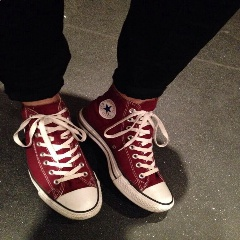
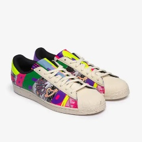

# A Tool-kit Of Techniques To Make Computer Vision Models Easier To Train And Evaluate
AIExpo Africa 2022 - Poster Presentation 

[Poster at the event](https://github.com/TRex22/MakeAISpeedy/raw/main/Final%20Poster%20Design.pdf)

## About me
I am a senior software engineer at a Fin-tech called DocFox and a master’s candidate at the University of the Witwatersrand focusing on computer vision, explainable AI and self-driving cars.

My blog: https://jasonchalom.com/blog

## Thanks
- My girlfriend :)
- My master's supervisor: Dr Richard Klein
- The Mathematical Sciences Support unit at the University of the Witwatersrand.
- PRIME Lab (Located at the University of the Witwatersrand, specialising in Computer Vision)
- Rail lab (https://www.raillab.org/)

# Abstract (150)
Machine learning techniques, especially in the area of computer vision, have opened a new frontier of research and industry - however the initial cost of entry into the field is a boundary, especially in developing economies. There are many techniques and approaches to optimising these work-flows in order to make them more computationally efficient, and therefore cheaper. Such techniques include traditional software engineering, data and signals processing, as well as more advanced optimisations to the model structures and training pipelines to make the process more efficient. These techniques have trade-offs and are task dependant but when combined appropriately can be a powerful tool-kit to improve computability of large work-flows. This poster evaluates a selection of techniques aimed at making computer vision easier to compute in memory usage, processor load, and time. These techniques are not always appropriate, and therefore several different types of tasks are considered.

# Introduction
Artificial intelligence (AI) is a fundamental part of the next industrial revolution. There is a lot of opportunity for innovation. However the cost, and access to AI - especially in computer vision - is a limiting factor in developing economies. AI on the edge is also limited by the practicality of the AI being used and such low power and embedded devices.

Many AI projects and state of the art models ignore training and evaluation cost in favour of the best results of the model. There are diminishing returns to obtaining the absolute best performance out of a model. Whilst having better accuracy and low loss when training AI models is desirable, practical use of such models does not always require the trade-offs of obtaining the best results and an acceptable level of error for more efficient use of computer resources can be acceptable.

# Methodology
For this investigation a classification problem, determining the brand of shoe from a given image is chosen\[1]. This is a fairly common use case of such AI systems. The dataset is small at 16.53 MB in total, with three categories of shoes.

## Examples from the data set

## Scope of experiments
Each experiment has a specific focus on a component of a simple computer vision pipeline:
1. This experiment looks at different models, their performance, time cost, and memory cost
2. Here I look at the effect of pre-processing the input image dimensional size and associated metrics of the chosen baseline model
3. The last experiment applies platform and library specific optimisations and evaluates the effect on the metrics of the chosen baseline model

## Metrics which are evaluated
1. The Accuracy of both training and test dataset splits
2. The time to complete an individual run of an experiment
3. Amount of memory is used by the AI model
4. The effective use of memory by an experimental run\*
\*This was only done for experiment 3, to evaluate the effect of those optimisations on memory usage

Only a synthetic performance metric of the accuracy of the test set is used. More advanced metrics of performance should be evaluated in the future.

## Hardware used
I made use of my workstation which has 64GB of RAM, 6 core CPU with 12 threads and an Nvidia RTX 3060 with 12GB of RAM.

# Experiment 1 - A look at different models
This experiment looks at the impact of model size on the accuracy of each

# Experiment 2 - A look at image pre-processing

# Experiment 3 - The application of programmatic optimisations

# Conclusion

# Limitations of the work done

# Future work

# References
- \[1] Nike, Adidas and Converse Shoes Images, https://www.kaggle.com/datasets/die9origephit/nike-adidas-and-converse-imaged, 18 September 2022
